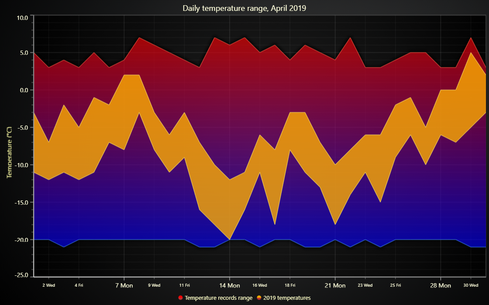

# Temperature Variations JavaScript Chart



This demo application belongs to the set of examples for LightningChart JS, data visualization library for JavaScript.

LightningChart JS is entirely GPU accelerated and performance optimized charting library for presenting massive amounts of data. It offers an easy way of creating sophisticated and interactive charts and adding them to your website or web application.

The demo can be used as an example or a seed project. Local execution requires the following steps:

-   Make sure that relevant version of [Node.js](https://nodejs.org/en/download/) is installed
-   Open the project folder in a terminal:

          npm install              # fetches dependencies
          npm start                # builds an application and starts the development server

-   The application is available at _http://localhost:8080_ in your browser, webpack-dev-server provides hot reload functionality.


## Description

The example shows the basic usage of Area Range series to display variation in temperature.

Range charts are generally used to show variations (low & high) simultaneously in the given period.

```javascript
// Create a new ChartXY.
const chart = lightningChart().ChartXY()

// Add an area series with bipolar direction using default X and Y axes.
const areaRange = chart.addAreaRangeSeries()
```

The series accepts **_AreaPoint_** type of points either as an object in format  
`{ position: number, high: number, low: number }`,

```javascript
series.add({ position: 20, high: 45, low: -20 })
```

or via a factory that should be additionally imported.

```javascript
series.add(AreaPoint(20, 45, -20))
```

Any number of points can be added with a single call.

```javascript
// Single point.
series.add({ position: 20, high: 45, low: -20 })

// Multiple points at once.
series.add([
    { position: 20, high: 45, low: -20 },
    { position: 40, high: 95, low: 10 },
    { position: 60, high: 25, low: 60 },
])
```


## API Links

* [XY cartesian chart]
* [Area point]
* [Area Range series]


## Support

If you notice an error in the example code, please open an issue on [GitHub][0] repository of the entire example.

Official [API documentation][1] can be found on [LightningChart][2] website.

If the docs and other materials do not solve your problem as well as implementation help is needed, ask on [StackOverflow][3] (tagged lightningchart).

If you think you found a bug in the LightningChart JavaScript library, please contact sales@lightningchart.com.

Direct developer email support can be purchased through a [Support Plan][4] or by contacting sales@lightningchart.com.

[0]: https://github.com/Arction/
[1]: https://lightningchart.com/lightningchart-js-api-documentation/
[2]: https://lightningchart.com
[3]: https://stackoverflow.com/questions/tagged/lightningchart
[4]: https://lightningchart.com/support-services/

© LightningChart Ltd 2009-2022. All rights reserved.


[XY cartesian chart]: https://lightningchart.com/js-charts/api-documentation/v7.0.1/classes/ChartXY.html
[Area point]: https://lightningchart.com/js-charts/api-documentation/v7.0.1/interfaces/AreaPoint.html
[Area Range series]: https://lightningchart.com/js-charts/api-documentation/v7.0.1/classes/AreaRangeSeries.html

